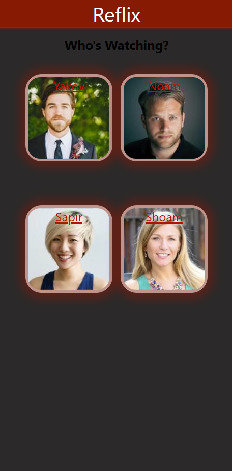
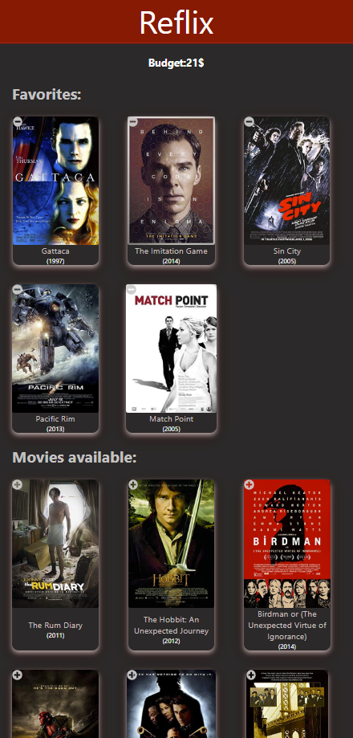
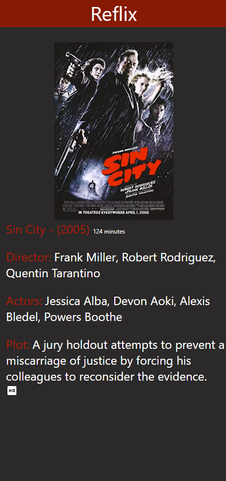
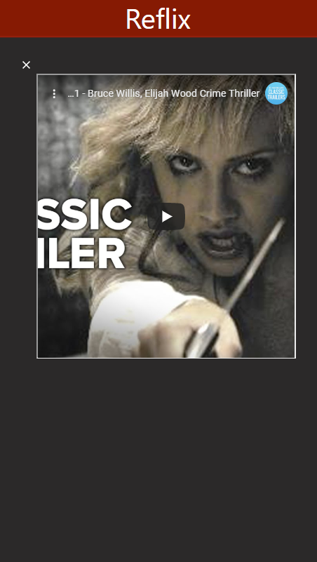

# Reflix

Reflix is a movie detail/rent platform built with React. It includes movie inforamtion and adding to favorites.
Full responsive design.
## Contributors
- Noam Mualmi (nonomu)
## Table Of Contents
- [Reflix](#reflix)
  - [Contributors](#contributors)
  - [Table Of Contents](#table-of-contents)
  - [Running the project](#running-the-project)
  - [Screenshots](#screenshots)
    - [Home](#home)
    - [Movies](#Movies)
    - [Login](#login)
    - [Movie-Detailes](#Movie-Detailes)

  - [Tech-stack](#tech-stack)

## Running the project
1. Clone the repo.
2. Run `npm install`.
3. Run `node server.js`.
4. Run `Pg Admin`.
5. Run `($env:REACT_APP_NOT_SECRET_CODE = 'YOURE_API_KEY_HERE') -and (npm start)` with youre google api key.
6. Navigate to `http://localhost:3000`.

## Screenshots

### Home
A short introduction to the platform. The user can choose his user to see his details.

### Movies
All movies that user has Rented or available to rent. (each user has a budget)

### Movie-Detailes
Movie detail with a trailers

### Movie-trailer
Movie trailer with close button

## Tech-stack
1. React, Material-UI, React-Icons, and Axios, Youtube Api.
2. Express (Node.js), Sequelize (Postgress).
